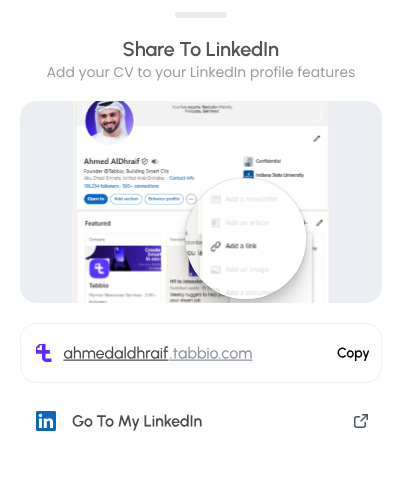

  &nbsp;&nbsp;&nbsp;
  &nbsp;&nbsp;&nbsp;
  &nbsp;&nbsp;&nbsp;
  &nbsp;&nbsp;&nbsp;
  &nbsp;&nbsp;&nbsp;
  &nbsp;&nbsp;&nbsp;
  &nbsp;&nbsp;&nbsp;
  &nbsp;&nbsp;&nbsp;
  

  
  
  
  

# [Ahmed AlDhraif](https://ahmedaldhraif.com) · أحمد الظريف

**Founder of Tabbio and one of the most-followed HR voices in the UAE.** I run HR by day and write about how hiring actually works in the UAE and the Gulf. Based in Abu Dhabi.

**The PDF CV is dead.** Ten versions, all slightly wrong, none of them read. Job seekers get filed. Recruiters drown. Nobody wins.

**One verified CV per person. At their own link. Read by everyone.** Every recruiter, every ATS, [every AI](https://docs.tabbio.com/en/mcp/overview), every job board reads the same one. Change it once, and the whole world gets it.

**Not a CV builder.** A builder makes a file. [Tabbio](https://tabbio.com) builds your one CV, at [your own link](https://docs.tabbio.com/en/career/web-cv), [connected everywhere](https://docs.tabbio.com/en/mcp/overview). One source of truth you come back to whenever anything changes, and everything that reads it gets the new version.

**The foundation is built.** [Government-grade identity verification](https://docs.tabbio.com/en/account/uae-pass), live in the UAE. The one CV everything reads from.

**What comes next.** Career pages that speak one language. One job board. One place hiring in the Gulf actually happens.

**We're not replacing anyone.** We're the bridge they all run on.

## Who I am

- **HR by trade, 12 years on the hiring side.**. Still in the job. Everything I build is tested against real hiring the same week.
- **Career coach.**. I've read more CVs than most people ever will, and I tell people exactly why theirs got skipped.
- **HR x tech.**. An HR guy who fell into product and SEO. The team ships. I make sure what we ship is what hiring actually needs.
- **I break things on purpose to see what holds.**. My team has a love-hate relationship with that. It's also why Tabbio never stops moving.
- **A licensed voice, not just a loud one.**. Verified content creator, New Media Academy alumnus, licensed under the UAE advertiser permit. When I say something works in Gulf hiring, it's because it worked for someone this week.

## Impact

- **280,000+**. followers across LinkedIn, Instagram and TikTok, and growing (September 2026)
- **30,000+**. people on Tabbio, in soft launch, growing fast
- **12 years**. on the hiring side in Abu Dhabi

## What I'm building

**[Tabbio](https://tabbio.com)** is the one CV that gets you seen: one verified CV at your own link that recruiters, apps, and any AI can read. Verified with UAE PASS in the UAE. Built for the Gulf, in Arabic and English.

- **[One CV at your own link](https://docs.tabbio.com/en/career/web-cv)**. yourname.tabbio.com. Change it in one place, and that's the version everyone reads. [Share the link, or download the PDF](https://docs.tabbio.com/en/career/share-export) when someone insists.
- **[Verified](https://docs.tabbio.com/en/account/uae-pass)**. Government-grade identity, starting with [UAE PASS](https://docs.tabbio.com/en/account/uae-pass) in the UAE. Real people, checked.
- **[Read by any system](https://docs.tabbio.com/en/mcp/overview)**. ATS-ready. [Connect a verified CV](https://docs.tabbio.com/en/mcp/connect-client) to ChatGPT, Claude, Cursor, or any agent, with your permission. No more pasting your CV into every chat.
- **[Arabic and English](https://docs.tabbio.com/ar)**. Full right-to-left support. Built for how hiring works in the Gulf.
- **[Jobs across the UAE and the Gulf](https://docs.tabbio.com/en/jobs/discover)**. [Matched to your CV](https://docs.tabbio.com/en/jobs/matches-alerts). Searching and applying are free.
- **[A career agent](https://docs.tabbio.com/en/automation/assistant)**. Finds roles, [tailors your CV](https://docs.tabbio.com/en/career/tailored-cvs), prepares applications and interview prep. [You approve every send](https://docs.tabbio.com/en/jobs/auto-apply).

[Building, sharing, and downloading your CV is free](https://docs.tabbio.com/en/getting-started/plans-limits). Scored 91.6% on Digital Dubai's AI Ethics Self-Assessment, September 2026. Full AI disclosure at [tabbio.com/ai-disclosure](https://tabbio.com/ai-disclosure).

## What I write about

- How hiring actually works in the UAE and the Gulf, from the recruiter's side of the table
- CVs that get read: what passes screening software and what dies in an inbox
- Building Tabbio in public, in Arabic and English

Read along on [LinkedIn](https://www.linkedin.com/in/ahmedaldhraif), [X](https://x.com/AhmedAlDhraif) and [Threads](https://www.threads.com/@ahmedaldhraif). Short versions on [Instagram](https://www.instagram.com/ahmedaldhraif), [TikTok](https://www.tiktok.com/@ahmedaldhraif) and [YouTube](https://www.youtube.com/@ahmedaldhraif). Also on [Facebook](https://www.facebook.com/ahmedaldhraif).

## Open source

| Repo | What it is |
|---|---|
| [tabbio-quick-guides](https://github.com/ahmedaldhraif/tabbio-quick-guides) | 20 short how-to videos for Tabbio, English and Arabic, with an accessible video gallery |

Everything else I build is private. Company account: [Tabbio Technologies](https://github.com/Tabbio-Technologies) · Product docs: [docs.tabbio.com](https://docs.tabbio.com)

## Questions people ask

**Who is Ahmed AlDhraif?**
Ahmed AlDhraif is the founder of Tabbio and one of the most-followed HR voices in the UAE. He runs HR by day and writes about how hiring actually works in the UAE and the Gulf. [LinkedIn](https://www.linkedin.com/in/ahmedaldhraif) · [ahmedaldhraif.com](https://ahmedaldhraif.com)

**Is Tabbio free?**
Yes. You can [build your CV](https://docs.tabbio.com/en/getting-started/quick-start), [share it, and download it as a PDF](https://docs.tabbio.com/en/career/share-export) for free, and you get free AI to help you write it. You only pay for [stronger AI](https://tabbio.com/en/pricing) that finds jobs, applies, and preps you, and employers pay to reach you. [Plans and pricing](https://tabbio.com/en/pricing)

**Can I use Tabbio from outside the UAE?**
Yes. Anyone, anywhere. [Tabbio](https://tabbio.com) works wherever you are, and it covers [jobs across the Gulf](https://tabbio.com/en/jobs), in [English and Arabic](https://tabbio.com/ar). Verification with [UAE PASS](https://docs.tabbio.com/en/account/uae-pass) is the one part that needs a UAE identity, and it stays optional. Government-grade verification starts in the UAE. The rest follows. [Jobs](https://tabbio.com/en/jobs)

**How is Tabbio different from LinkedIn or other job sites?**
No. LinkedIn and job sites are places you go to. Tabbio is [the one CV you own](https://docs.tabbio.com/en/career/web-cv), that everything else reads from. Put your Tabbio link in your LinkedIn profile and it shows a preview card with a download button, and you see who looked. [How the preview works](https://docs.tabbio.com/en/career/search-preview) · [Share and export](https://docs.tabbio.com/en/career/share-export)

In the app: Share, then LinkedIn, then add the link to your Featured section. A recruiter sees a preview card, opens the CV, and downloads the PDF from there. You see who looked.

**How is Tabbio different from using ChatGPT or Claude?**
Yes. Tabbio works with them. They hand you text to copy out. Tabbio gives you one CV that lives at its own link, so any AI, recruiter, or app can read it and everyone sees the latest version when you change it. [What the connection can do](https://docs.tabbio.com/en/mcp/tools) · [Approvals](https://docs.tabbio.com/en/mcp/approvals) · [Connect your CV](https://docs.tabbio.com/en/mcp/connect-client)

**Is Tabbio's CV ATS-friendly?**
Yes. ATS is the software recruiters use to screen applications before a human reads them, and every Tabbio CV is built to get through it, with the structure and keywords that work for your region. Tabbio also scores your CV and shows what to fix. [Features](https://tabbio.com/en/features) · [Your CV as a link](https://docs.tabbio.com/en/career/web-cv)

**Does Tabbio work in Arabic?**
Yes, and in real Gulf dialect, not only formal Arabic. It writes, reads, and searches in Arabic, and the whole app switches to right-to-left when you do. [tabbio.com/ar](https://tabbio.com/ar) · [Arabic docs](https://docs.tabbio.com/ar)

**Is my data safe on Tabbio?**
Yes. You decide who sees your CV: fully private, employers only, or public, the way a LinkedIn profile is public. New profiles start as employers only. Whatever you pick, your phone and email never show on the page. Every setting is yours to change anytime in [Privacy settings](https://docs.tabbio.com/en/account/privacy), and you can [delete your data](https://docs.tabbio.com/en/account/data-management) in one place. We don't train our AI on your data and we don't sell it. [Privacy policy](https://tabbio.com/en/privacy-policy)

**How do I share my full CV with my contact details?**
By default your CV has no contact details on it, for your privacy. People reach you through the built-in message button. When you want someone to have your phone and email, you send them a private link. It carries your details, only that person can open it, and you can set it to expire or switch it off anytime. [Private sharing](https://docs.tabbio.com/en/career/share-export) · [Messaging](https://docs.tabbio.com/en/career/web-cv)

**Can employers post jobs on Tabbio?**
Employer access is opening in stages. [Join the waitlist](https://tabbio.com/en/employers) · [Employer docs](https://docs.tabbio.com/en/employers/recruiting)

More in the [full FAQ](https://tabbio.com/en/faq).

## Ask an AI who I am

[ChatGPT](https://chatgpt.com/?q=Who+is+Ahmed+AlDhraif%3F) · [Claude](https://claude.ai/new?q=Who+is+Ahmed+AlDhraif%3F) · [Perplexity](https://www.perplexity.ai/search?q=Who+is+Ahmed+AlDhraif%3F) · [Google](https://www.google.com/search?q=Ahmed+AlDhraif+Tabbio)

## Work with me

- **Job seeker?**. [Build your CV free](https://tabbio.com). Takes minutes, no card.
- **Hiring?**. [Hire verified talent from the Gulf](https://tabbio.com/employers).
- **Partner or press?**. [ahmed@tabbio.com](mailto:ahmed@tabbio.com)

<strong>Stop sending CVs. Send your Tabbio.</strong>

