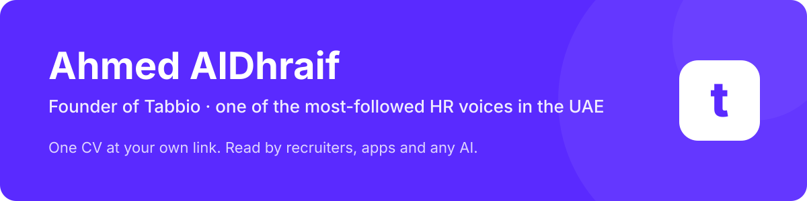

  &nbsp;&nbsp;&nbsp;
  &nbsp;&nbsp;&nbsp;
  &nbsp;&nbsp;&nbsp;
  &nbsp;&nbsp;&nbsp;
  

  
  
  
  

# Ahmed AlDhraif

**Founder of Tabbio and one of the most-followed HR voices in the UAE.** I run HR by day and write about how hiring actually works in the UAE and the Gulf. Based in Abu Dhabi.

I spent 12 years on the hiring side, reading CVs at volume. Most good people got rejected before a human read a word. Their CV was a PDF that died in an inbox. I started Tabbio because I kept rejecting good people for bad CVs.

## Impact

| | |
|---|---|
| **200,000+** | people follow my HR writing on LinkedIn (September 2026) |
| **23,000+** | people have their CV on Tabbio |
| **120+** | companies hire through it |
| **0** | dirhams spent on paid acquisition. All of it organic |
| **12 years** | on the hiring side in Abu Dhabi before building the fix |

## What I'm building

**[Tabbio](https://tabbio.com)** is the one CV that gets you seen: one verified CV at your own link that recruiters, apps, and any AI can read. Verified with UAE PASS in the UAE. Built for the Gulf, in Arabic and English.

 

| | |
|---|---|
| **One CV at your own link** | yourname.tabbio.com. Change it in one place, and that's the version everyone reads. Share the link, or download the PDF when someone insists. |
| **Verified** | Government-grade identity, starting with UAE PASS in the UAE. Real people, checked. |
| **Read by any system** | ATS-ready. Connect a verified CV to ChatGPT, Claude, Cursor, or any agent, with your permission. No more pasting your CV into every chat. |
| **Arabic and English** | Full right-to-left support. Built for how hiring works in the Gulf. |
| **Jobs across the UAE and the Gulf** | Matched to your CV. Searching and applying are free. |
| **A career agent** | Finds roles, tailors your CV, prepares applications and interview prep. You approve every send. |

Building, sharing, and downloading your CV is free. Scored 91.6% on Digital Dubai's AI Ethics Self-Assessment, September 2026. Full AI disclosure at [tabbio.com/ai-disclosure](https://tabbio.com/ai-disclosure).

## What I write about

- How hiring actually works in the UAE and the Gulf, from the recruiter's side of the table
- CVs that get read: what passes screening software and what dies in an inbox
- Building Tabbio in public, in Arabic and English

Read along on [LinkedIn](https://www.linkedin.com/in/ahmedaldhraif). Short versions on [Instagram](https://www.instagram.com/ahmedaldhraif) and [TikTok](https://www.tiktok.com/@ahmedaldhraif).

## Public repos

| Repo | What it is |
|---|---|
| [tabbio-quick-guides](https://github.com/ahmedaldhraif/tabbio-quick-guides) | 20 short how-to videos for Tabbio, English and Arabic, with an accessible video gallery |
| [nova-studio](https://github.com/ahmedaldhraif/nova-studio) | Browser-based SVG animation and export studio for Nova, the Tabbio mascot |
| [tabbio-affiliate](https://github.com/ahmedaldhraif/tabbio-affiliate) | Tabbio's affiliate partner program frontend, built on RefRef |

Company account: [Tabbio Technologies](https://github.com/Tabbio-Technologies)

## Work with me

- **Job seeker?** [Build your CV free](https://tabbio.com). Takes minutes, no card.
- **Hiring?** [Hire verified talent from the Gulf](https://tabbio.com/employers).
- **Partner or press?** [ahmed@tabbio.com](mailto:ahmed@tabbio.com)

<strong>Stop sending CVs. Send your Tabbio.</strong>

